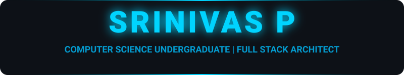
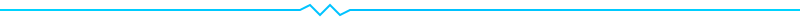

<div align="center">

<!-- ══════════════════════════════════════════════════════════════ -->
<!--                     ANIMATED HERO BANNER                      -->
<!-- ══════════════════════════════════════════════════════════════ -->



<br>

<!-- DEV LOGO / CODING GIF -->


<br>

<!-- DYNAMIC TELEMETRY -->
<a href="https://git.io/typing-svg"></a>

<br>

<!-- STATUS INDICATORS -->

&nbsp;

&nbsp;


</div>

<br>



<!-- ══════════════════════════════════════════════════════════════ -->
<!--                     NEURAL INTERFACE (ABOUT)                  -->
<!-- ══════════════════════════════════════════════════════════════ -->

<div align="center">
  
</div>

<br>

<div align="center">
<table width="100%" border="0">
<tr>
<td width="55%" align="left">

```js
/* ═══════════════════════════════════════
   🧠 IDENTITY MODULE: srinivas.sys
   ═══════════════════════════════════════ */

const SRINIVAS = {
    origin: "📍 Mysore, India",
    education: {
        degree: "B.E. Computer Science",
        campus: "VVCE",
        focus: ["FullStack", "AI/ML", "Security"]
    },
    philosophy: "Building the impossible, one bug at a time.",
    hobbies: ["☕ Engineering Caffeine", "🎮 Virtual Realities", "🛠️ Building Bots"],
    currentMode: "🔥 ALWAYS BUILDING"
};

// INITIALIZING CORE PROTOCOLS...
SRINIVAS.deployPerformanceMode();
```

</td>
<td width="45%" align="left">

```yaml
# ═══════════════════════════════════════
#  🎯 ACTIVE MISSIONS
# ═══════════════════════════════════════

objective: 🚀 Pushing the boundaries of Web3 & PWAs
learning: ⚛️ Mastering Advanced React & Neural Ops
battle_scars:
  - 🥈 Silver Medal | Parivarthan Hackathon
  - 🥉 Bronze Medal | Spark Hackathon
status: 🛡️ Freelance Weaponry for Web
motto: |
  "In a world of zeros and ones,
   be the one who writes the future."
```

</td>
</tr>
</table>
</div>

<br>


<!-- ══════════════════════════════════════════════════════════════ -->
<!--                     COMMAND ARSENAL (TECH)                    -->
<!-- ══════════════════════════════════════════════════════════════ -->

<div align="center">
  
</div>

<br>

<div align="center">

### 🧪 CORE ENGINE STACK

<br>

<a href="#"></a>
<br><br>
<a href="#"></a>
<br><br>
<a href="#"></a>
<br><br>
<a href="#"></a>

<br><br>

### 📈 SKILL TELEMETRY

<br>


</div>

<br>


<!-- ══════════════════════════════════════════════════════════════ -->
<!--                     DEPLOYED MISSIONS (PROJECTS)              -->
<!-- ══════════════════════════════════════════════════════════════ -->

<div align="center">
  
</div>

<br>

<div align="center">
<table width="100%">
<tr>
<td align="center" width="50%">
  
  <br>
  <strong>[ CURRENT HQ ]</strong>
</td>
<td align="center" width="50%">
  
  <br>
  <strong>[ INNOVATION HUB ]</strong>
</td>
</tr>
</table>
</div>

<br>


<!-- ══════════════════════════════════════════════════════════════ -->
<!--                     SYSTEM ANALYTICS                          -->
<!-- ══════════════════════════════════════════════════════════════ -->

<div align="center">
  
</div>

<br>

<div align="center">


&nbsp;


<br><br>


<br><br>


</div>

<br>


<!-- ══════════════════════════════════════════════════════════════ -->
<!--                     CONTRIBUTION FLOW                         -->
<!-- ══════════════════════════════════════════════════════════════ -->

<div align="center">
  
</div>

<br>

<div align="center">
  
</div>

<br>


<!-- ══════════════════════════════════════════════════════════════ -->
<!--                     SOCIAL UPLINK                             -->
<!-- ══════════════════════════════════════════════════════════════ -->

<div align="center">
  
</div>

<br>

<div align="center">

```
 ╔═══════════════════════════════════════════════════════╗
 ║        >>> ESTABLISHING SECURE CONNECTION <<<         ║   
 ║                 HANDSHAKE SUCCESSFUL                  ║
 ║           CONNECT WITH ME ON THESE PORTS              ║   
 ╚═══════════════════════════════════════════════════════╝
```

<br>

<a href="https://www.linkedin.com/in/srinivas-p-632b79394"></a>
&nbsp;&nbsp;
<a href="https://www.instagram.com/srini._23"></a>
&nbsp;&nbsp;
<a href="mailto:srinivas2006.srini@gmail.com"></a>
&nbsp;&nbsp;
<a href="https://github.com/Srinivas2s"></a>

</div>

<br>


<div align="center">
  
</div>
